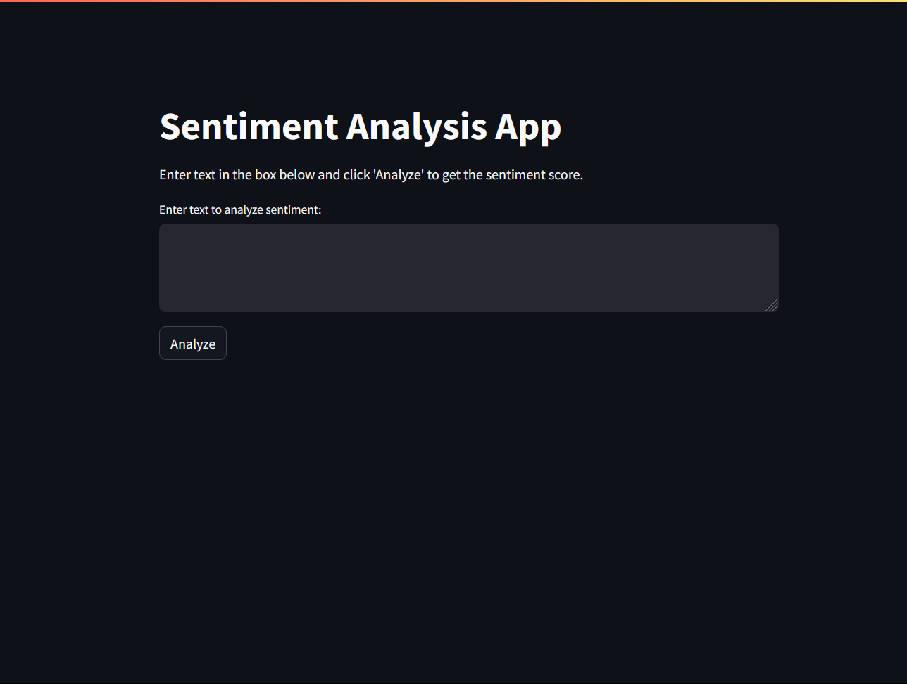
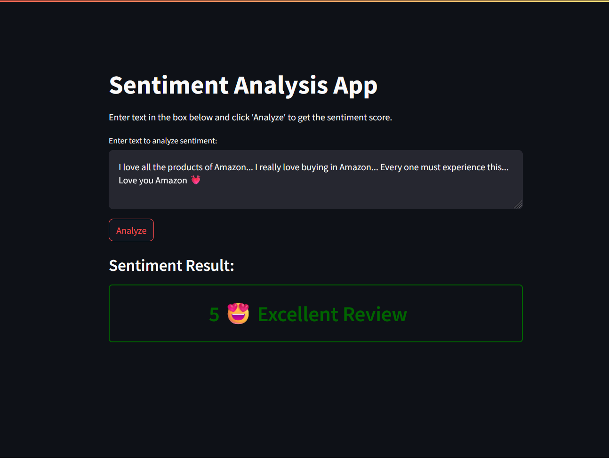
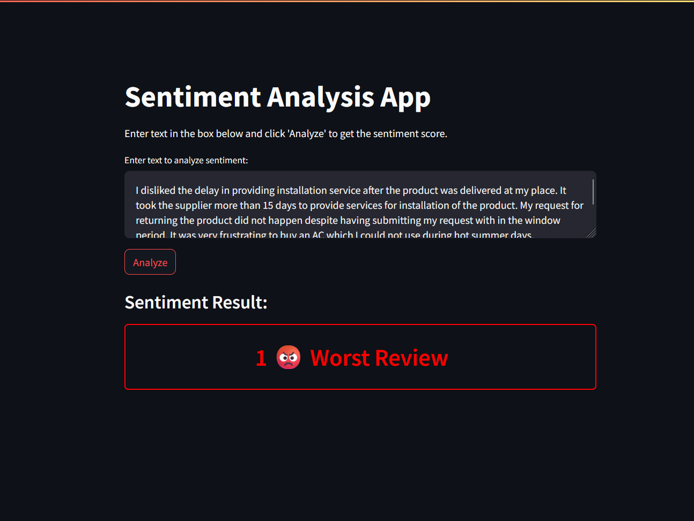
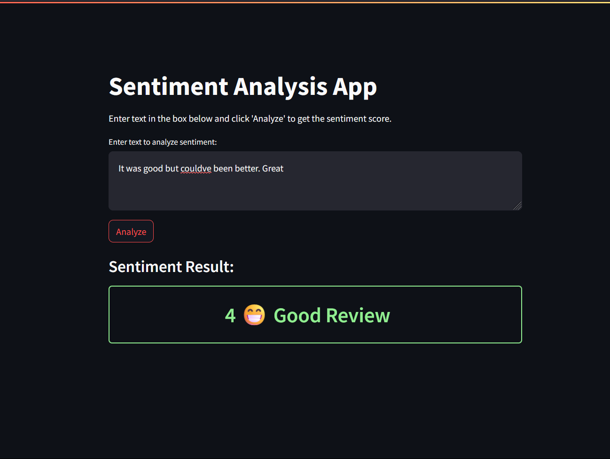
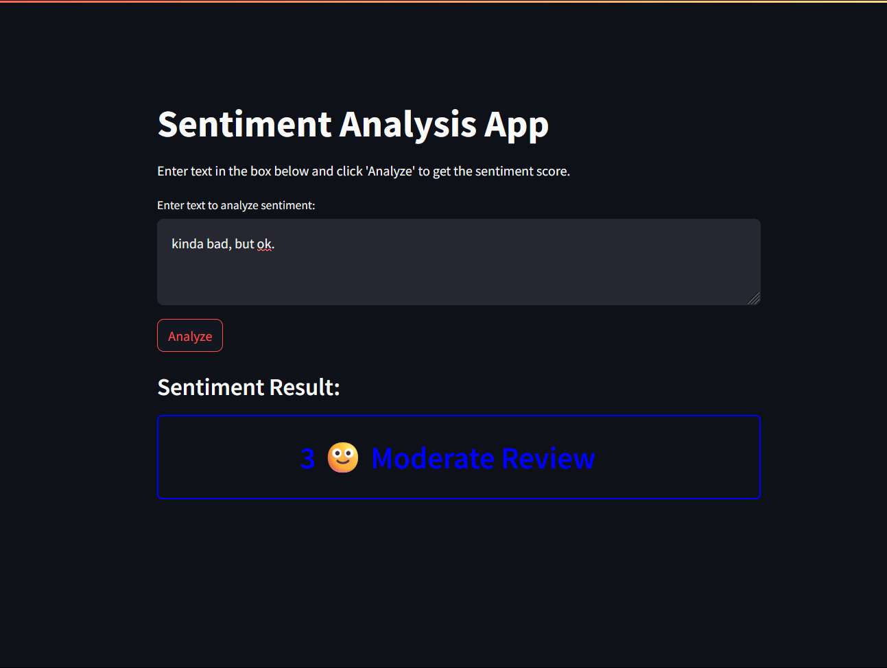
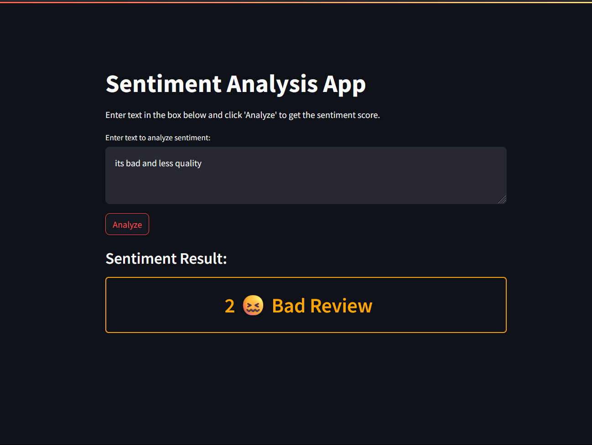

# Sentiment Analysis App

This project is a Sentiment Analysis App built using Streamlit and the `transformers` library from Hugging Face. The app allows users to input text and analyze its sentiment using a pre-trained BERT model.

## Overview

The Sentiment Analysis App performs the following tasks:

- Takes user input as text.
- Uses a pre-trained BERT model to analyze the sentiment of the input text.
- Displays the sentiment score.

## Features

- **Pre-trained BERT Model**: Utilizes the `nlptown/bert-base-multilingual-uncased-sentiment` model from Hugging Face for sentiment analysis.
- **Visual Feedback**: Sentiment results are displayed with emojis, descriptive text.

## Setup Instructions

### Prerequisites

- Python 3.6 or higher
- Streamlit
- `transformers` library
- `torch` library

### Screen Shots-

# Image Gallery

|     |  |
| ---------------------------------------- | ----------------------------------------- |
|     |       |
|  |        |

### Installation

1. Clone the repository:

   ```sh
   git clone https://github.com/yourusername/sentiment-analysis-app.git
   cd sentiment-analysis-app
   ```

2. Install the required packages:
   ```sh
   pip install -r requirements.txt
   ```

### Running the App

To run the app locally, execute the following command:

```sh
streamlit run app.py
```
